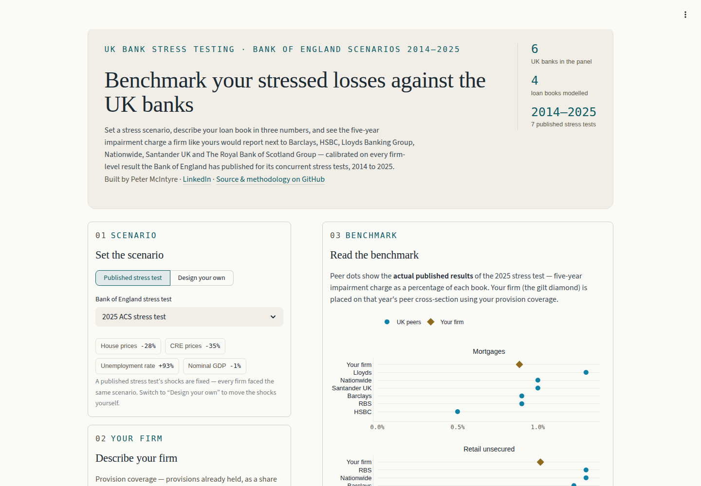
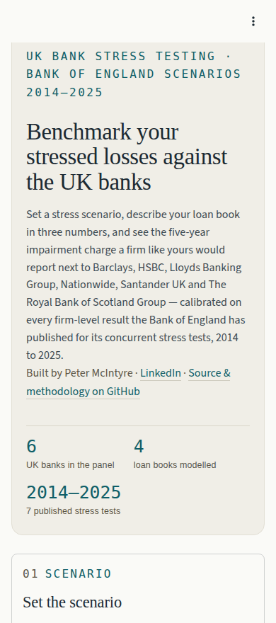

# UK bank stress-test benchmarking

<!-- Badge URLs are absolute (GitHub requires it) and currently point at
     quietsnooze/Pm_benchmarking. If this repo is renamed to
     uk-stress-test-benchmarking, update the two hard-coded owner/repo
     segments below. -->
[](https://github.com/quietsnooze/Pm_benchmarking/actions/workflows/ci.yml)

**Live app: [pmbenchmarking-y8gmpbxd6n9te6htd8w886.streamlit.app](https://pmbenchmarking-y8gmpbxd6n9te6htd8w886.streamlit.app/)**

A Python rewrite of a legacy R analysis that benchmarks UK bank stress-test
losses against the Bank of England's published concurrent stress-test
scenarios (2014–2025). Describe a loan book in three provision-coverage
numbers, pick a scenario, and see where a firm like yours would sit among
the UK's major banks.



## What it answers

Given a Bank of England stress scenario and a firm's pre-stress provision
coverage, what five-year impairment charge would that firm report on its
mortgage, retail unsecured, commercial real estate, and business lending
books — and how does that compare with the UK banks the Bank of England
has actually stress-tested since 2014?

The app supports two modes:

- **A published stress test** (e.g. the 2019 ACS). Within a single test
  every participating firm faces exactly the same macro shocks, so the
  shocks themselves carry no cross-firm information. Peers are shown as
  their **actual published results**; your firm is placed on that year's
  peer cross-section by a small regression on provision coverage alone —
  read it as a positioning, not a forecast.
- **A custom scenario**. Here the shocks vary, so the app falls back to
  the cross-scenario model (below) fitted across every published test —
  or, via a toggle, just the three most recent.

## How the benchmark is built

Every published BoE concurrent stress test reports, per participating firm,
the five-year impairment charge on each major UK lending book. For the
cross-scenario model, those outcomes are regressed on the **worst point of
each scenario's macro paths** (house prices, commercial real estate prices,
unemployment, GDP, corporate profits, Bank Rate) plus each firm's
**pre-stress provision coverage** — one ordinary-least-squares model per
product, fitted with backward-AIC variable selection. **Firm identity is
deliberately excluded**: no model is allowed to rate a firm as riskier than
its peers on the strength of its name. The mortgage model additionally
offers each firm's buy-to-let share of its mortgage book as a stepwise
candidate, kept only if it improves the fit.

The port reproduces the legacy R analysis's scenario features — the
low-point shocks — to floating-point precision against a 2019-vintage gold
reference (`tests/test_scenarios.py`); see [Repo tour](#repo-tour) below.

The in-app "How the benchmark is built" expander carries the full detail —
fitted R² per product, coefficient tables, actual-vs-predicted charts, and
the underlying modelling dataset — for anyone who wants to check the
working.

<details>
<summary>Mobile screenshot</summary>



</details>

## Data sources

All source data is public: Bank of England concurrent stress-test scenario
workbooks and results publications (2014–2025), plus a small set of
hand-compiled Pillar 3 provision-coverage figures. Full provenance —
publication URLs, dates, and notes on anything transcribed by hand — is
recorded in [SOURCES.md](SOURCES.md).

Raw files (`raw_inputs/`) are **not committed** — they're large and
reproducible from the URLs in `SOURCES.md`. The processed, analysis-ready
CSVs (`processed_inputs/`) **are** committed, so a fresh clone has everything
the app needs without re-running ingest.

## Repo tour

| Path | Role |
| --- | --- |
| `app.py` | Streamlit rendering/interaction layer only — no modelling logic lives here. Exempt from tests per project policy; `tests/test_app_smoke.py` covers wiring. |
| `src/uk_stress_benchmark/scenarios.py` | Low-point-shock feature engineering from BoE scenario paths. |
| `src/uk_stress_benchmark/scenario_index.py` | The year → scenario-file manifest; the one place that knows which scenario is canonical per year. |
| `src/uk_stress_benchmark/results.py` | Loader for firm-level published impairment charges, incl. the 2014 3yr→5yr imputation rule. |
| `src/uk_stress_benchmark/provisions.py` | Loaders for provision coverage and buy-to-let share. |
| `src/uk_stress_benchmark/imputation.py` | Small LM-based fill for the one BoE workbook gap (2014 corporate profits). |
| `src/uk_stress_benchmark/pipeline.py` | Assembles the modelling dataset and fits the four per-product OLS models (`RECIPES`, `fit_product_models`). |
| `src/uk_stress_benchmark/models.py` | The regression primitives: dummy variables, OLS fit with backward-AIC selection, prediction. |
| `src/uk_stress_benchmark/viz.py` | Pure Plotly figure builders, unit-tested independently of Streamlit. |
| `src/uk_stress_benchmark/extract_appendix_tables.py` | Parses bank-specific impairment tables out of BoE results PDFs. |
| `src/uk_stress_benchmark/extract_scenarios.py` | Flattens BoE variable-paths workbooks into per-scenario CSVs. |
| `src/uk_stress_benchmark/aggregate_firm_results.py` | Consolidates the per-table extracts into one tidy `firm_results.csv`. |
| `src/uk_stress_benchmark/sync_sources.py` | Downloads raw files declared in `SOURCES.md`. |
| `src/uk_stress_benchmark/extract_provisions.py` | Builds the annual provision-coverage panel (`firm_provisions_annual.csv`) from EBA transparency-exercise credit-risk CSVs. |
| `src/uk_stress_benchmark/ingest.py` | Runs the ingest steps above in order — the data "build" entrypoint. |

Every module in `src/uk_stress_benchmark/` has a test file in `tests/`.
Two are worth calling out:

- `tests/test_scenarios.py::test_real_data_low_point_shocks_match_legacy_r_gold`
  is the R-parity gold regression: it reproduces the legacy R analysis's
  low-point shocks to floating-point precision against that analysis's own
  output file. The reference file lives in the gitignored `old_version/`
  tree, so this test only runs (and only can run) on a machine that also
  has the legacy R repo checked out alongside this one — it skips cleanly
  in CI and on a fresh clone.
- `tests/test_loaders_regression.py` exercises the loaders against the real
  committed `processed_inputs/` CSVs, catching drift between what the
  ingest pipeline produces and what the loaders expect.

## Quickstart

Managed with [uv](https://docs.astral.sh/uv/).

```bash
uv sync --extra dev              # install runtime + dev dependencies
uv run streamlit run app.py      # local dev server
uv run pytest                    # run the test suite
```

Rebuilding `processed_inputs/` from scratch (requires raw files — see
`SOURCES.md`):

```bash
uv run sync-sources     # download raw inputs declared in SOURCES.md
uv run extract-tables   # parse BoE results-PDF impairment tables
uv run extract-scenarios # flatten BoE variable-paths workbooks
uv run extract-provisions # EBA transparency CSVs -> annual provision coverage panel
uv run ingest            # all of the above, in order
```

## Development notes

- **Test-driven development.** New logic is written red → green → refactor,
  per the workflow in `.claude/skills/tdd/`. The Streamlit UI layer is the
  one deliberate exception — it's tested for wiring only, not rendering.
- **Deep modules, narrow interfaces** (Ousterhout, *A Philosophy of
  Software Design*) is the standing design directive: each module earns its
  place by hiding real logic behind a small public surface, not by being a
  thin pass-through. `app.py`'s docstring and the module docstrings above
  are the enforcement mechanism — see `Public surface:` in each module.
- **CI** (`.github/workflows/ci.yml`, job `check`) runs on every push to
  `main` and every pull request: `ruff format --check`, `ruff check`,
  `pyright`, then `pytest` — the same commands documented above, run via
  `uv sync --extra dev` first so the workflow matches a local clone
  exactly.

## Disclaimer

Built on public Bank of England data. This is a portfolio project, not
investment advice and not a regulatory model — it does not reproduce, and
is not endorsed by, the Bank of England's own stress-testing framework.

---

Peter McIntyre · [LinkedIn](https://www.linkedin.com/in/pemcintyre/)
